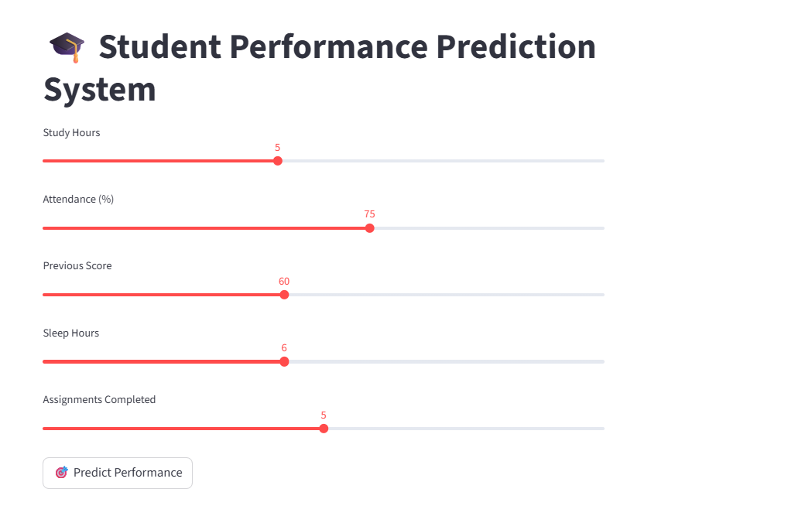
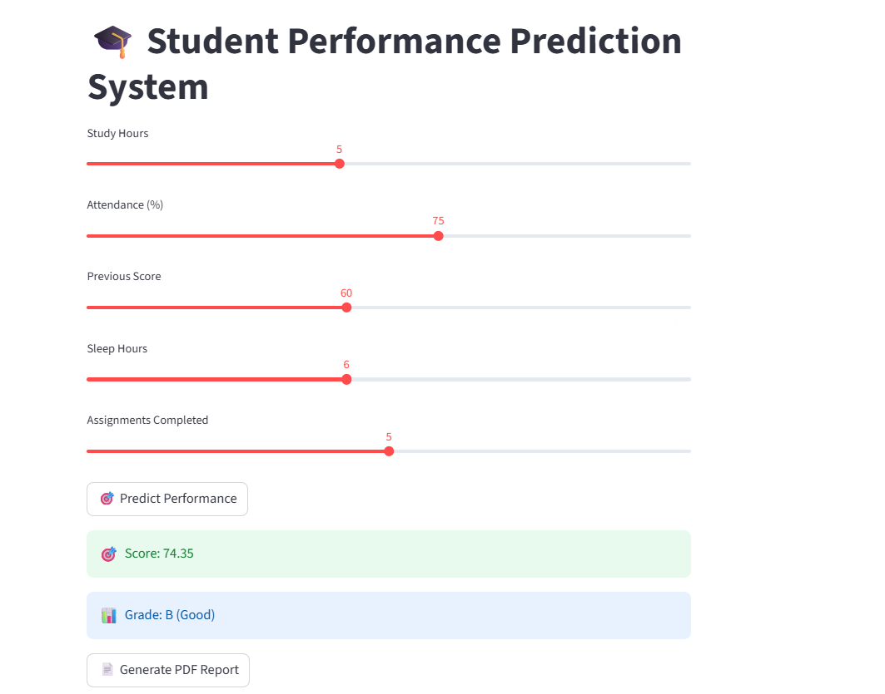
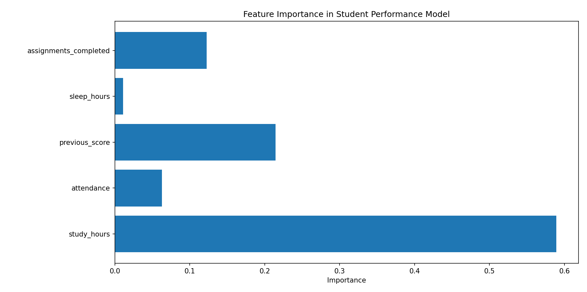
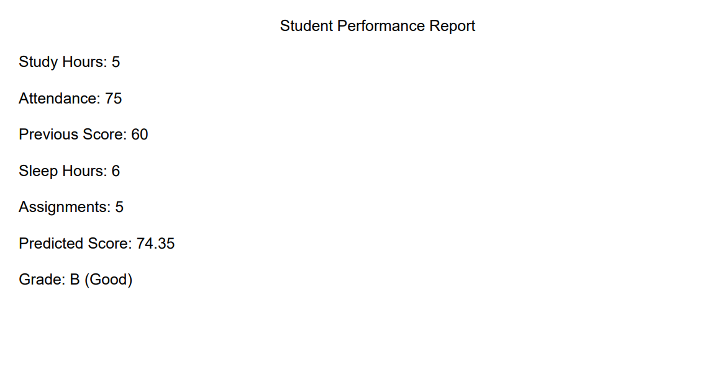

# 🎓 Student Performance Prediction System

🚀 An End-to-End Machine Learning project that predicts student academic performance based on study habits and behavioral factors.

---

## 📌 Overview
This system uses ML models to analyze student data and predict:
- 📊 Performance Score (0–100)
- 🏆 Grade Classification (A / B / C / D)

It also provides insights into which factors impact performance the most.

---

## ✨ Features
✔ Real-time prediction using Streamlit UI  
✔ Grade classification system  
✔ Feature importance (model explainability)  
✔ Automated PDF report generation  
✔ Complete ML pipeline (data → model → deployment)  

---

## ⚙️ Tech Stack
**Python | Pandas | NumPy | Scikit-learn | Streamlit | Matplotlib | Joblib**

---

## ▶️ Run Locally
```bash
pip install -r requirements.txt
streamlit run app.py
```

---

## 📸 Screenshots

### 🏠 Dashboard  


### 🎯 Prediction Result  


### 📊 Feature Importance  


### 📄 Sample Report 



---

## 🌐 Links
🔗 GitHub:https://github.com/needhi-x/Student-Performance-Prediction

🚀 Live Demo:https://student-performance-prediction-8duvrikgmqvtm2z3bsfslm.streamlit.app/

---

## 🔮 Future Improvements
- Add real-world dataset  
- Improve model accuracy using advanced algorithms  
- Add student login system  
- Store data using database integration  
- Deploy with cloud scalability  

---

## Author

Nidhi Apotikar

⭐ Built as part of my Machine Learning journey
